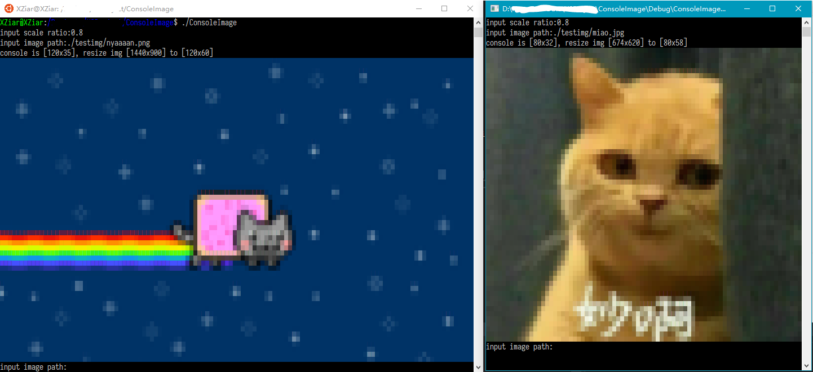

# ConsoleImage

Print image in console!

## Requirements

### Windows
 * VisualStudio 2017
 * Window 10 ( higher than 10.0.10586 )

### Linux
 * Any compiler support C++11
 * Terminal with RGB color support
 * Tested on WSL only

## Usage

Run `make` or build it in VS.

With argument `-sh`, image will be output to a shell script near the original image, rather than outout to the console.

## Dependency
 * **[stb](https://github.com/nothings/stb)** single-file public domain libraries for C/C++ 
 * **[fmt](https://github.com/fmtlib/fmt)** A modern formatting library

## License
ConsoleImage (including its component) is licensed under the [MIT license](./LICENSE).
